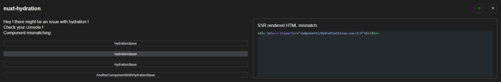

# nuxt-hydration

:warning: This module is still under development :warning:

## Feature

- Make sure you are aware when there's a hydration issue
  - hint which components mismatched
  - show the SSR rendered HTML
    


## Installation

- run `yarn|pnpm|npm install -D nuxt-hydration`
- add it to your nuxt.config
```ts
export default defineNuxtConfig({
  modules: ['nuxt-hydration']
})
```
- that's it !